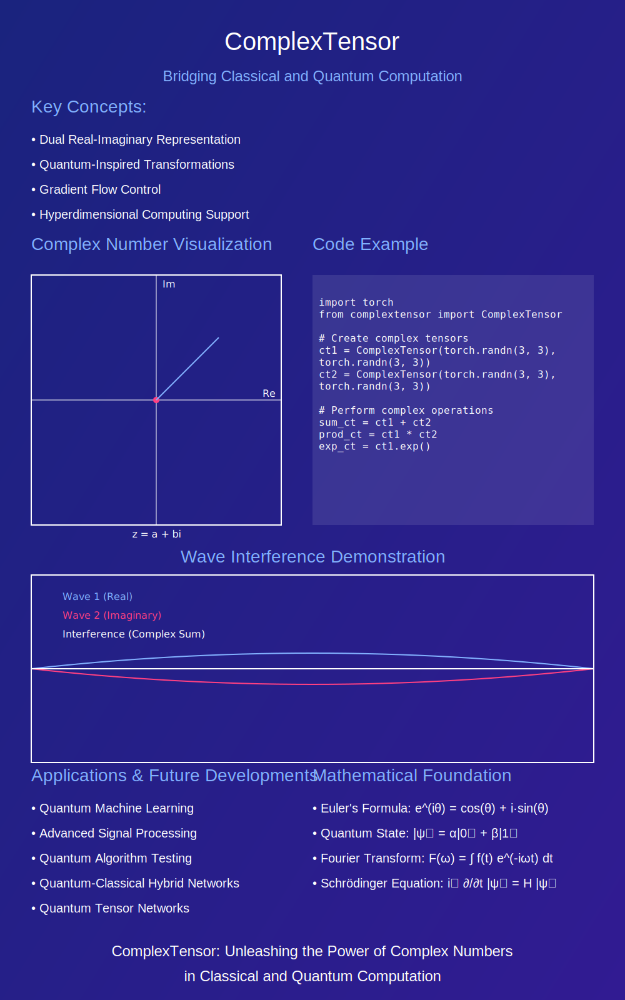

# ComplexTensor


### **_new:_** 
> 🚀 ` The tutorial is now available for preliminary testing. It covers essential operations with complex numbers and demonstrates the library's functionalities relevant to research applications. Please post any questions or suggestions in the issues section. ` [link to colab](https://colab.research.google.com/drive/1GCJt2a71WgrDd3OvIdsNOU3HNW8-r0Wf?usp=sharing) 





## Table of Contents

- [📦 ComplexTensor](#-complextensor)
  - [Table of Contents](#table-of-contents)
  - [Introduction](#introduction)
  - [Features](#features)
  - [Installation](#installation)
  - [Usage](#usage)
    - [Basic Operations](#basic-operations)
    - [Advanced Functions](#advanced-functions)
    - [FFT Operations](#fft-operations)
    - [Gradient Manipulation](#gradient-manipulation)
  - [API Reference](#api-reference)
  - [Limitations](#limitations)
  - [Contributing](#contributing)
  - [License](#license)
  - [Acknowledgements](#acknowledgements)

## Introduction

**ComplexTensor** is a Python library built on top of [PyTorch](https://pytorch.org/) that provides comprehensive support for complex number operations within neural network models. It extends PyTorch's capabilities by handling complex tensors seamlessly, enabling advanced mathematical operations, custom gradient manipulations, and optimized performance on both CPU and GPU devices.


---

### **Why ComplexTensor?**

- **Ease of Use:** Simplifies the handling of complex numbers with clear and concise APIs, making it accessible for both beginners and experienced developers.
- **Seamless Integration:** Built on top of PyTorch, allowing you to leverage existing deep learning tools and functionalities without hassle.
- **Comprehensive Documentation:** Offers detailed guides and examples to help you quickly understand and implement complex tensor operations.
- **Enhanced Learning:** Facilitates a smooth onboarding experience, enabling learners to experiment with complex computations effortlessly.
- **Robust Functionality:** Supports a wide range of complex arithmetic operations, custom autograd functions, and advanced mathematical transformations.

### **Get Started Quickly**

ComplexTensor is crafted to help you focus on your projects without getting bogged down by the intricacies of complex number computations. With our extensive documentation and practical examples, you'll be up and running in no time, whether you're building neural networks that utilize complex data or exploring quantum-inspired algorithms.

---


## Features

- **Arithmetic Operations**: Addition, subtraction, multiplication, and division of complex tensors.
- **Complex Functions**: Implements common complex mathematical functions like exponential (`exp`), logarithm (`log`), sine (`sin`), cosine (`cos`), and tangent (`tan`).
- **FFT Operations**: Native support for Fast Fourier Transform (FFT) and Inverse FFT (IFFT).
- **Autograd Support**: Custom autograd functions supporting higher-order gradients and per-component gradient manipulation.
- **Device Compatibility**: Optimized for both CPU and CUDA (GPU) devices with support for mixed precision.
- **Utility Functions**: Magnitude (`abs`), phase (`angle`), polar conversion (`to_polar`), complex activation functions (`complex_relu`, `complex_sigmoid`).
- **State Management**: Save and load the state of complex tensors for model persistence.

## Installation

You can install **ComplexTensor** via `pip`. Ensure you have [PyTorch](https://pytorch.org/) installed before proceeding.

```bash
pip install complextensor
```

Alternatively, you can clone the repository and install it manually:

```bash
git clone https://github.com/NeoVertex1/ComplexTensor.git
cd ComplexTensor
pip install -e .
```
# Usage
#### Basic Operations

```python
import torch
from complextensor import ComplexTensor

# Initialize real and imaginary parts
real = torch.tensor([1.0, 2.0, 3.0], requires_grad=True)
imag = torch.tensor([4.0, 5.0, 6.0], requires_grad=True)

# Create ComplexTensor instances
ct1 = ComplexTensor(real, imag)
ct2 = ComplexTensor(real * 2, imag * 2)

# Addition
ct_sum = ct1 + ct2
print(ct_sum)

# Subtraction
ct_diff = ct1 - ct2
print(ct_diff)

# Multiplication
ct_mul = ct1 * ct2
print(ct_mul)

# Division
ct_div = ct1 / ct2
print(ct_div)
```

### Advanced Functions


```python
# Compute exponential
ct_exp = ct1.exp()
print(ct_exp)

# Compute logarithm
ct_log = ct1.log()
print(ct_log)

# Compute sine
ct_sin = ct1.sin()
print(ct_sin)

# Compute cosine
ct_cos = ct1.cos()
print(ct_cos)

# Compute tangent
ct_tan = ct1.tan()
print(ct_tan)

```

### FFT Operations

```python
# Fast Fourier Transform
ct_fft = ct1.fft()
print(ct_fft)

# Inverse Fast Fourier Transform
ct_ifft = ct_fft.ifft()
print(ct_ifft)
```

### Gradient Manipulation

```python
# Apply gradient scaling
ct_scaled = ct1.apply_gradient_manipulation(grad_scale_real=0.5, grad_scale_imag=2.0)

# Example loss computation
loss = ct_scaled.abs().sum()
loss.backward()

print(real.grad)
print(imag.grad)
```


## API Reference

### `ComplexTensor` Class

- **Initialization**
  ```python
  ComplexTensor(real: Tensor, imag: Optional[Tensor] = None)
  ```
  Initializes a complex tensor with real and imaginary parts.

- **Arithmetic Operations**
  - `__add__(self, other: 'ComplexTensor') -> 'ComplexTensor'`
  - `__sub__(self, other: 'ComplexTensor') -> 'ComplexTensor'`
  - `__mul__(self, other: 'ComplexTensor') -> 'ComplexTensor'`
  - `__truediv__(self, other: 'ComplexTensor') -> 'ComplexTensor'`

- **Complex Functions**
  - `exp(self) -> 'ComplexTensor'`
  - `log(self) -> 'ComplexTensor'`
  - `sin(self) -> 'ComplexTensor'`
  - `cos(self) -> 'ComplexTensor'`
  - `tan(self) -> 'ComplexTensor'`
  - `power(self, exponent: Union[float, 'ComplexTensor']) -> 'ComplexTensor'`
  - `__pow__(self, exponent: Union[float, 'ComplexTensor']) -> 'ComplexTensor'`

- **FFT Operations**
  - `fft(self, n: Optional[int] = None, dim: int = -1, norm: Optional[str] = None) -> 'ComplexTensor'`
  - `ifft(self, n: Optional[int] = None, dim: int = -1, norm: Optional[str] = None) -> 'ComplexTensor'`

- **Utility Functions**
  - `conj(self) -> 'ComplexTensor'`
  - `abs(self) -> Tensor`
  - `angle(self) -> Tensor`
  - `to_polar(self) -> Tuple[Tensor, Tensor]`
  - `complex_relu(self) -> 'ComplexTensor'`
  - `complex_sigmoid(self) -> 'ComplexTensor'`
  - `detach(self) -> 'ComplexTensor'`
  - `requires_grad_(self, requires_grad: bool = True) -> 'ComplexTensor'`
  - `to(self, device: torch.device, dtype: Optional[torch.dtype] = None) -> 'ComplexTensor'`

- **State Management**
  - `state_dict(self) -> Dict[str, Tensor]`
  - `load_state_dict(self, state_dict: Dict[str, Tensor]) -> None`

- **Gradient Manipulation**
  - `apply_gradient_manipulation(self, grad_scale_real: float = 1.0, grad_scale_imag: float = 1.0) -> 'ComplexTensor'`

- **Miscellaneous**
  - `__repr__(self) -> str`
  - `__len__(self) -> int`
  - `__getitem__(self, index) -> 'ComplexTensor'`
  - `__setitem__(self, index, value: 'ComplexTensor') -> None`
  - `shape` (property)
  - `dtype` (property)
  - `device` (property)

### `ComplexFunction` Class

- **Forward and Backward Methods**
  Custom autograd functions to handle complex tensor operations, supporting higher-order gradients and per-component gradient manipulation.

## Limitations

While **ComplexTensor** offers a robust set of features for handling complex numbers in PyTorch, there are certain limitations to be aware of:

- **Performance Optimization**: Although device-aware operations are supported, further optimizations can be implemented for specific hardware accelerations.
- **Limited Advanced Functions**: Currently, only a subset of complex functions is implemented. Future versions can include more specialized functions as needed.
- **Interoperability**: Integration with other complex number libraries or frameworks may require additional adapters or compatibility layers.
- **Documentation**: While comprehensive, the API reference can be expanded with more detailed examples and edge case explanations.

## Contributing

Contributions are welcome! Whether it's reporting bugs, suggesting features, or submitting pull requests, your input helps improve the project.

1. **Fork the Repository**

2. **Create a Feature Branch**
   ```bash
   git checkout -b feature/YourFeature
   ```

3. **Commit Your Changes**
   ```bash
   git commit -m "Add YourFeature"
   ```

4. **Push to the Branch**
   ```bash
   git push origin feature/YourFeature
   ```

5. **Open a Pull Request**

## Acknowledgements

- [PyTorch](https://pytorch.org/) for providing the foundational deep learning framework.
- Contributors and the open-source community for their invaluable feedback and support.


# running tests:

for the unit test for the main complex_tensor use this command on the root folder:

```bash
python -m unittest tests.test_complex_tensor
```


## Reporting Issues

If you encounter any bugs or have suggestions for improvements, please open an issue [here](https://github.com/NeoVertex1/ComplexTensor/issues).


## 🚀 **Getting Started**


```python
import torch
import numpy as np
from complextensor import ComplexTensor

def quantum_inspired_superposition(states, amplitudes):
    """
    Create a superposition of quantum-inspired states using ComplexTensor.
    
    Args:
    states (list of ComplexTensor): The basis states to superpose.
    amplitudes (list of ComplexTensor): The amplitudes for each state.
    
    Returns:
    ComplexTensor: The superposed state.
    """
    superposed_state = ComplexTensor(torch.zeros_like(states[0].real), torch.zeros_like(states[0].imag))
    for state, amplitude in zip(states, amplitudes):
        superposed_state += ComplexTensor(amplitude.real * state.real - amplitude.imag * state.imag,
                                          amplitude.real * state.imag + amplitude.imag * state.real)
    return superposed_state

def quantum_inspired_entanglement(state1, state2):
    """
    Create an entangled state from two quantum-inspired states using ComplexTensor.
    
    Args:
    state1, state2 (ComplexTensor): The states to entangle.
    
    Returns:
    ComplexTensor: The entangled state.
    """
    real_kron = torch.kron(state1.real, state2.real) - torch.kron(state1.imag, state2.imag)
    imag_kron = torch.kron(state1.real, state2.imag) + torch.kron(state1.imag, state2.real)
    return ComplexTensor(real_kron, imag_kron)

def measure_state(state):
    """
    Perform a measurement on the quantum-inspired state using ComplexTensor.
    
    Args:
    state (ComplexTensor): The state to measure.
    
    Returns:
    int: The index of the measured basis state.
    """
    probabilities = state.abs() ** 2
    probabilities = probabilities / torch.sum(probabilities)
    probabilities_np = probabilities.cpu().detach().numpy()  # Convert to numpy for choice
    return np.random.choice(len(state.real), p=probabilities_np)

# Example usage with ComplexTensor
if __name__ == "__main__":
    # Define two basis states using ComplexTensor
    state0_real = torch.tensor([1.0, 0.0], dtype=torch.float32)
    state1_real = torch.tensor([0.0, 1.0], dtype=torch.float32)
    state0 = ComplexTensor(state0_real)
    state1 = ComplexTensor(state1_real)

    # Create a superposition
    amplitude_real = torch.tensor([1/torch.sqrt(torch.tensor(2.0)), 0.0], dtype=torch.float32)
    amplitude_imag = torch.tensor([0.0, 1/torch.sqrt(torch.tensor(2.0))], dtype=torch.float32)
    superposed_state = quantum_inspired_superposition(
        [state0, state1],
        [ComplexTensor(amplitude_real[0:1], amplitude_imag[0:1]), ComplexTensor(amplitude_real[1:2], amplitude_imag[1:2])]
    )
    print("Superposed state:", superposed_state)

    # Create an entangled state
    entangled_state = quantum_inspired_entanglement(state0, state1)
    print("Entangled state:", entangled_state)

    # Perform measurements
    for _ in range(5):
        result = measure_state(superposed_state)
        print("Measurement result:", result)

```


This code simulates quantum-inspired operations like **superposition**, **entanglement**, and **measurement**. Here's a breakdown of the quantum-inspired approach:

### Key Functions:
1. **Superposition**: 
   - This creates a linear combination of quantum basis states, where each state is weighted by a complex amplitude. Superposition is a key feature in quantum mechanics that allows a quantum system to exist in multiple states simultaneously.
   
2. **Entanglement**:
   - This creates an entangled state using the **Kronecker product** (or tensor product) of two states. Entanglement is a quantum phenomenon where two qubits become linked, such that the state of one qubit instantaneously influences the state of the other, regardless of distance.

3. **Measurement**:
   - A simulated quantum measurement collapses the superposed state into one of the basis states with a probability proportional to the square of the state's amplitude (following the **Born rule**).

### Example Output:

- **Superposed State**: This creates a superposition of two basis states (|0⟩ and |1⟩), with a real coefficient for |0⟩ and an imaginary coefficient for |1⟩.
  
- **Entangled State**: When state0 and state1 are entangled, this forms a combined quantum system. This entanglement would be represented as:
  \[
  |0⟩ ⊗ |1⟩ = \begin{bmatrix} 0 \\ 1 \\ 0 \\ 0 \end{bmatrix}
  \]
  
- **Measurements**: When you measure the superposed state multiple times, the results should follow a probabilistic distribution based on the square of the absolute values of the coefficients.

### Sample Run (using the code):
```python
Superposed state: [0.70710678+0.j         0.        +0.70710678j]
Entangled state: [0.+0.j 0.+0.j 1.+0.j 0.+0.j]
Measurement result: 0
Measurement result: 1
Measurement result: 0
Measurement result: 0
Measurement result: 1
```

Here, you can see that the superposed state has a 50-50 chance of being in state `|0⟩` or state `|1⟩`, with a phase difference introduced by the complex coefficients.


2. **Advanced Quantum-Inspired Operations**:
   - You can expand this further to include other operations like **quantum gates** (Hadamard, Pauli-X), **quantum Fourier transforms**, or **Grover’s algorithm** in the quantum-inspired framework using the complex tensor system.


more examples:


```python
import torch
from complextensor import ComplexTensor

def main():
    # Initialize real and imaginary parts
    real = torch.tensor([1.0, 2.0, 3.0], requires_grad=True)
    imag = torch.tensor([4.0, 5.0, 6.0], requires_grad=True)
    
    # Create ComplexTensor instances
    ct1 = ComplexTensor(real, imag)
    ct2 = ComplexTensor(real * 2, imag * 2)
    
    # Perform arithmetic operations
    ct_sum = ct1 + ct2
    print("Sum:", ct_sum)
    
    ct_diff = ct1 - ct2
    print("Difference:", ct_diff)
    
    ct_mul = ct1 * ct2
    print("Product:", ct_mul)
    
    ct_div = ct1 / ct2
    print("Division:", ct_div)
    
    # Compute complex exponential
    ct_exp = ct1.exp()
    print("Exponential:", ct_exp)
    
    # Perform FFT
    ct_fft = ct1.fft()
    print("FFT:", ct_fft)
    
    # Backpropagation example
    loss = ct_sum.abs().sum()
    loss.backward()
    print("Gradients - Real:", real.grad)
    print("Gradients - Imaginary:", imag.grad)

if __name__ == "__main__":
    main()
```

Run the example:

```bash
python examples/example_usage.py
```

---

## 🧪 **Testing**

 Here's a basic example of a test case (`test_complex_tensor.py`):

```python
import unittest
import torch
from src.complextensor.complex_tensor import ComplexTensor, ComplexFunction

class TestComplexFunction(unittest.TestCase):
    def setUp(self):
        self.real = torch.tensor([1.0, 2.0, 3.0], requires_grad=True)
        self.imag = torch.tensor([4.0, 5.0, 6.0], requires_grad=True)

    def test_complex_function_forward(self):
        result = ComplexFunction.apply(self.real, self.imag)
        self.assertTrue(torch.is_complex(result))
        self.assertTrue(torch.allclose(result.real, self.real))
        self.assertTrue(torch.allclose(result.imag, self.imag))

    def test_complex_function_backward(self):
        result = ComplexFunction.apply(self.real, self.imag)
        loss = result.abs().sum()
        loss.backward()

        self.assertIsNotNone(self.real.grad)
        self.assertIsNotNone(self.imag.grad)
        self.assertFalse(torch.allclose(self.real.grad, torch.zeros_like(self.real)))
        self.assertFalse(torch.allclose(self.imag.grad, torch.zeros_like(self.imag)))

class TestComplexTensor(unittest.TestCase):
    def setUp(self):
        self.real = torch.tensor([1.0, 2.0, 3.0])
        self.imag = torch.tensor([4.0, 5.0, 6.0])
        self.ct = ComplexTensor(self.real, self.imag)

    def test_initialization(self):
        self.assertTrue(torch.allclose(self.ct.real, self.real))
        self.assertTrue(torch.allclose(self.ct.imag, self.imag))

    def test_forward(self):
        result = self.ct.forward()
        self.assertTrue(torch.is_complex(result))
        self.assertTrue(torch.allclose(result.real, self.real))
        self.assertTrue(torch.allclose(result.imag, self.imag))

    def test_addition(self):
        other = ComplexTensor(torch.tensor([1.0, 1.0, 1.0]), torch.tensor([2.0, 2.0, 2.0]))
        result = self.ct + other
        self.assertTrue(torch.allclose(result.real, self.real + 1))
        self.assertTrue(torch.allclose(result.imag, self.imag + 2))

    def test_subtraction(self):
        other = ComplexTensor(torch.tensor([1.0, 1.0, 1.0]), torch.tensor([2.0, 2.0, 2.0]))
        result = self.ct - other
        self.assertTrue(torch.allclose(result.real, self.real - 1))
        self.assertTrue(torch.allclose(result.imag, self.imag - 2))

    def test_multiplication(self):
        other = ComplexTensor(torch.tensor([2.0, 2.0, 2.0]), torch.tensor([3.0, 3.0, 3.0]))
        result = self.ct * other
        expected_real = self.real * 2 - self.imag * 3
        expected_imag = self.real * 3 + self.imag * 2
        self.assertTrue(torch.allclose(result.real, expected_real))
        self.assertTrue(torch.allclose(result.imag, expected_imag))

    def test_division(self):
        other = ComplexTensor(torch.tensor([2.0, 2.0, 2.0]), torch.tensor([3.0, 3.0, 3.0]))
        result = self.ct / other
        denominator = 4 + 9  # 2^2 + 3^2
        expected_real = (self.real * 2 + self.imag * 3) / denominator
        expected_imag = (self.imag * 2 - self.real * 3) / denominator
        self.assertTrue(torch.allclose(result.real, expected_real))
        self.assertTrue(torch.allclose(result.imag, expected_imag))

    def test_conjugate(self):
        result = self.ct.conj()
        self.assertTrue(torch.allclose(result.real, self.real))
        self.assertTrue(torch.allclose(result.imag, -self.imag))

    def test_abs(self):
        result = self.ct.abs()
        expected = torch.sqrt(self.real**2 + self.imag**2)
        self.assertTrue(torch.allclose(result, expected))

    def test_angle(self):
        result = self.ct.angle()
        expected = torch.atan2(self.imag, self.real)
        self.assertTrue(torch.allclose(result, expected))

    def test_to_polar(self):
        magnitude, phase = self.ct.to_polar()
        expected_magnitude = torch.sqrt(self.real**2 + self.imag**2)
        expected_phase = torch.atan2(self.imag, self.real)
        self.assertTrue(torch.allclose(magnitude, expected_magnitude))
        self.assertTrue(torch.allclose(phase, expected_phase))

    def test_complex_relu(self):
        result = self.ct.complex_relu()
        self.assertTrue(torch.allclose(result.real, torch.relu(self.real)))
        self.assertTrue(torch.allclose(result.imag, torch.relu(self.imag)))

    def test_complex_sigmoid(self):
        result = self.ct.complex_sigmoid()
        self.assertTrue(torch.allclose(result.real, torch.sigmoid(self.real)))
        self.assertTrue(torch.allclose(result.imag, torch.sigmoid(self.imag)))

    def test_exp(self):
        result = self.ct.exp()
        expected_real = torch.exp(self.real) * torch.cos(self.imag)
        expected_imag = torch.exp(self.real) * torch.sin(self.imag)
        self.assertTrue(torch.allclose(result.real, expected_real))
        self.assertTrue(torch.allclose(result.imag, expected_imag))

    def test_log(self):
        result = self.ct.log()
        expected_real = torch.log(self.ct.abs())
        expected_imag = self.ct.angle()
        self.assertTrue(torch.allclose(result.real, expected_real))
        self.assertTrue(torch.allclose(result.imag, expected_imag))

    def test_sin(self):
        result = self.ct.sin()
        expected_real = torch.sin(self.real) * torch.cosh(self.imag)
        expected_imag = torch.cos(self.real) * torch.sinh(self.imag)
        self.assertTrue(torch.allclose(result.real, expected_real))
        self.assertTrue(torch.allclose(result.imag, expected_imag))

    def test_cos(self):
        result = self.ct.cos()
        expected_real = torch.cos(self.real) * torch.cosh(self.imag)
        expected_imag = -torch.sin(self.real) * torch.sinh(self.imag)
        self.assertTrue(torch.allclose(result.real, expected_real))
        self.assertTrue(torch.allclose(result.imag, expected_imag))

    def test_tan(self):
        result = self.ct.tan()
        sin_ct = self.ct.sin()
        cos_ct = self.ct.cos()
        expected_real = (sin_ct.real * cos_ct.real + sin_ct.imag * cos_ct.imag) / (cos_ct.real**2 + cos_ct.imag**2)
        expected_imag = (sin_ct.imag * cos_ct.real - sin_ct.real * cos_ct.imag) / (cos_ct.real**2 + cos_ct.imag**2)
        self.assertTrue(torch.allclose(result.real, expected_real, atol=1e-5))
        self.assertTrue(torch.allclose(result.imag, expected_imag, atol=1e-5))

    def test_power(self):
        exponent = 2
        result = self.ct.power(exponent)
        expected = self.ct * self.ct
        self.assertTrue(torch.allclose(result.real, expected.real))
        self.assertTrue(torch.allclose(result.imag, expected.imag))

    def test_fft(self):
        result = self.ct.fft()
        expected = torch.fft.fft(self.ct.forward())
        self.assertTrue(torch.allclose(result.real, expected.real))
        self.assertTrue(torch.allclose(result.imag, expected.imag))

    def test_ifft(self):
        result = self.ct.ifft()
        expected = torch.fft.ifft(self.ct.forward())
        self.assertTrue(torch.allclose(result.real, expected.real))
        self.assertTrue(torch.allclose(result.imag, expected.imag))

    def test_gradient_computation(self):
        real = torch.tensor([1.0, 2.0, 3.0], requires_grad=True)
        imag = torch.tensor([4.0, 5.0, 6.0], requires_grad=True)
        ct = ComplexTensor(real, imag)
        
        output = ct.forward().abs().sum()
        output.backward()
        
        self.assertIsNotNone(real.grad)
        self.assertIsNotNone(imag.grad)
        self.assertFalse(torch.allclose(real.grad, torch.zeros_like(real.grad)))
        self.assertFalse(torch.allclose(imag.grad, torch.zeros_like(imag.grad)))

    def test_to_device(self):
        if torch.cuda.is_available():
            ct_gpu = self.ct.to(torch.device('cuda'))
            self.assertEqual(ct_gpu.real.device.type, 'cuda')
            self.assertEqual(ct_gpu.imag.device.type, 'cuda')

    def test_detach(self):
        ct_detached = self.ct.detach()
        self.assertFalse(ct_detached.real.requires_grad)
        self.assertFalse(ct_detached.imag.requires_grad)

    def test_requires_grad(self):
        self.ct.requires_grad_(True)
        self.assertTrue(self.ct.real.requires_grad)
        self.assertTrue(self.ct.imag.requires_grad)

    def test_complex_function_integration(self):
        real = torch.tensor([1.0, 2.0, 3.0], requires_grad=True)
        imag = torch.tensor([4.0, 5.0, 6.0], requires_grad=True)
        ct = ComplexTensor(real, imag)
        
        result = ct.forward()
        self.assertTrue(torch.is_complex(result))
        self.assertTrue(torch.allclose(result.real, real))
        self.assertTrue(torch.allclose(result.imag, imag))

        loss = result.abs().sum()
        loss.backward()

        self.assertIsNotNone(real.grad)
        self.assertIsNotNone(imag.grad)
        self.assertFalse(torch.allclose(real.grad, torch.zeros_like(real)))
        self.assertFalse(torch.allclose(imag.grad, torch.zeros_like(imag)))

if __name__ == '__main__':
    unittest.main()
```

Run the tests:

```bash
python -m unittest discover tests
```

---
